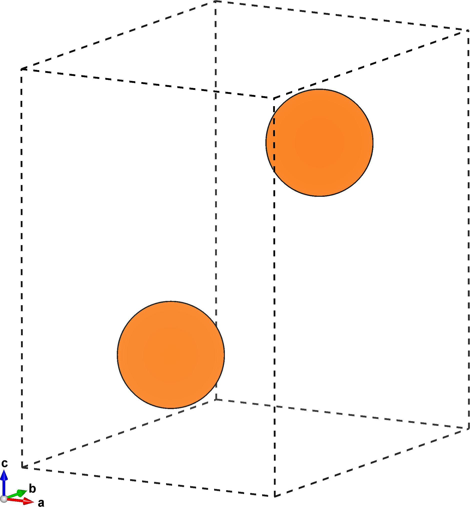
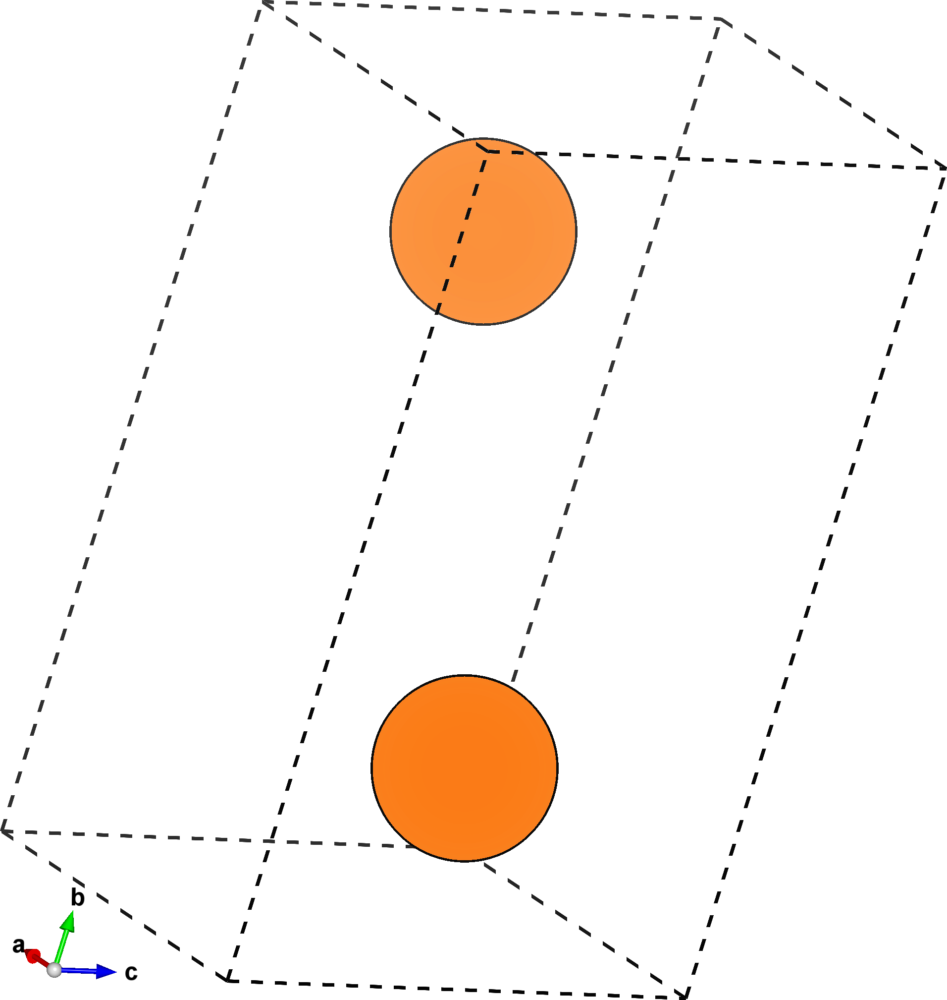



# Tutorial I: Creating a slab structure
In this tutorial we'll use `multishift-base` to create a superstructure of Mg with ab-vectors in the $$(1,0,1)$$ plane (pyramidal slip plane).
We'll specify how long we want the c-vector to be, resulting in a slab structure that can be used as a starting point for UBER or $$\gamma$$-surface calculations.

## Mg primitive cell
Current implementations of multishifter work exclusively with the [VASP](https://cms.mpi.univie.ac.at/vasp/guide/node59.html) structure format.
Download the primitive cell for Mg [here](mg.vasp), or create a file called `mg.vasp` with the following crystallographic data:

    multishifter tutorial i
    1.00000000
                           1.59609453       2.76451683       0.00000000
                          -1.59609453       2.76451683       0.00000000
                           0.00000000       0.00000000       5.18401957
    Mg
    2
    Direct
                   0.6666667    0.6666667    0.7500000 Mg
                   0.3333333    0.3333333    0.2500000 Mg

The figure below on the left shows the primitive unit cell of Mg, while the one on the right highlights the prismatic plane.
This is the slip plane we're interested in, and has miller indices $$(1,0,1)$$.

| {:height="100%" width="100%"} | {:height="100%" width="100%"} |

## Settings
In the same working directory where you saved `mg.vasp`, [save](pyramidal.json) the following settings as `pyramidal.json`:

```json
{
    "name" : "pyramidal_tutorial",
    "base":
    {
        "prim" : "./mg.vasp",
        "millers" : [1,0,1],
        "stacks" : 1
    }
}
```

The first entry ("name") is an identifier to give output generated by any multishifter tool in order to facilitate organization.
The second entry ("base") are the settings intended for `multishift-base`.
"prim" points it to the primitive structure we saved, and "millers" are the miller indices of the pyramidal slip plane.
Ignore "stacks" for now.

## Run `multishift-base`
From the same directory, execute

```bash
multishift-base -s pyramidal.json
```

## Output
You will now have a directory named `pyramidal_tutorial.base`.
`prim.vasp` is a copy of `mg.vasp`, and `base.json` is a copy of the "base" entry in `pyramidal.json`.
If you open `shift_unit.vasp` you'll see that it's the same Mg structure, with a newly defined lattice.
The ab-vectors are now both parallel to the slip plane.

| {:height="100%" width="100%"} | {:height="100%" width="100%"} |

## Stack the slab
