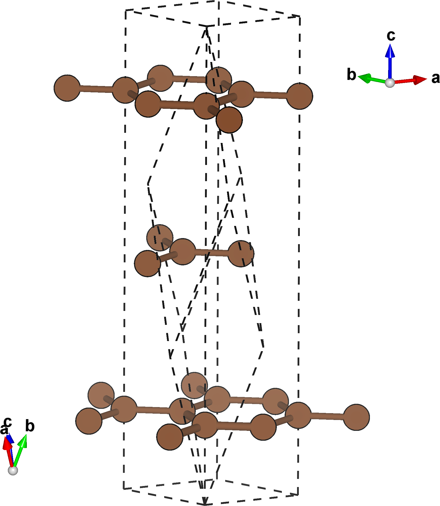



# Tutorial I: Slicing a structure
In this tutorial we'll use `multishift slice` to create a structure of $$\mathrm{Mg}$$ with ab-vectors in the $$(0,\bar{1},1)$$ plane (pyramidal slip plane).

## Mg primitive cell
Current implementations of `multishifter` work exclusively with the [VASP](https://cms.mpi.univie.ac.at/vasp/guide/node59.html) structure format.
Download the primitive cell for $$\mathrm{Mg}$$ [here](./mg.vasp), or create a file called `mg.vasp` with the following crystallographic data:

    multishifter tutorial i
    1.00000000
                           1.59609453       2.76451683       0.00000000
                          -1.59609453       2.76451683       0.00000000
                           0.00000000       0.00000000       5.18401957
    Mg
    2
    Direct
                   0.6666667    0.6666667    0.7500000 Mg
                   0.3333333    0.3333333    0.2500000 Mg

The figure below on the left shows the primitive unit cell of $$\mathrm{Mg}$$, while the one on the right highlights the prismatic plane.
This is the slip plane we're interested in, and has miller indices $$(0,\bar{1},1)$$.

| {:width="70%"} | {: width="70%"} |

## Slice the structure
From your working directory, run

```
multishift slice --input mg.vasp --millers 0 -1 1 --output mg_pyramidal.vasp
```

This will read `mg.vasp` as the starting structure, and slice it allong the specified miller indexes, saving the generated structure to `mg_pyramidal.vasp`.

## Output
You will now have a file named `mg_pyramidal.vasp`.
The plane defined by the `millers` argument is spanned by the $$ab$$ vectors of this structure.
By default, the `slice` command also performs a rigid rotation on the final structure, aligning the $$a$$ vector along the $$x$$ direction, and the $$b$$ vector in the $$xy$$ plane.
This final rotation can be supressed by using the flag `--dont-align`.
The rotation can also be applied to any structure using `multishift align`.

| {:width="100%"} | {:width="70%"} |

## Slicing graphite
In the previous example, the sliced structure was still a primitive cell, albeit with an unconventional definition.
If we slice the primitive cell of graphite along the $$(1,1,1)$$ layers, we'll see this isn't always the case.

Download the primitive cell for graphite [here](./graphite.vasp), or create a file called `graphite.vasp` with the following cyrstallographic data:

    multishifter tutorial i.b
    1.0
            4.2654600143         0.0000000000         0.0000000000
            3.5512614760         2.3627719025         0.0000000000
            3.5512614760         1.0734450299         2.1048531614
        C
        2
    Direct
         0.166667989         0.166668006         0.166667997
         0.833331925         0.833332067         0.833331971

You can repeat the slice command with new parameters now:

```
multishift slice --input graphite.vasp --millers 1 1 1 --output graphite_sliced.vasp
```

The resulting structure is a size 3 superstructure of the starting primitive structure, but has $$ab$$ vectors parallel to the individual graphene layers.
The figure below contrasts the primitive cell with the sliced structure.

<p align="center">
  
</p>
