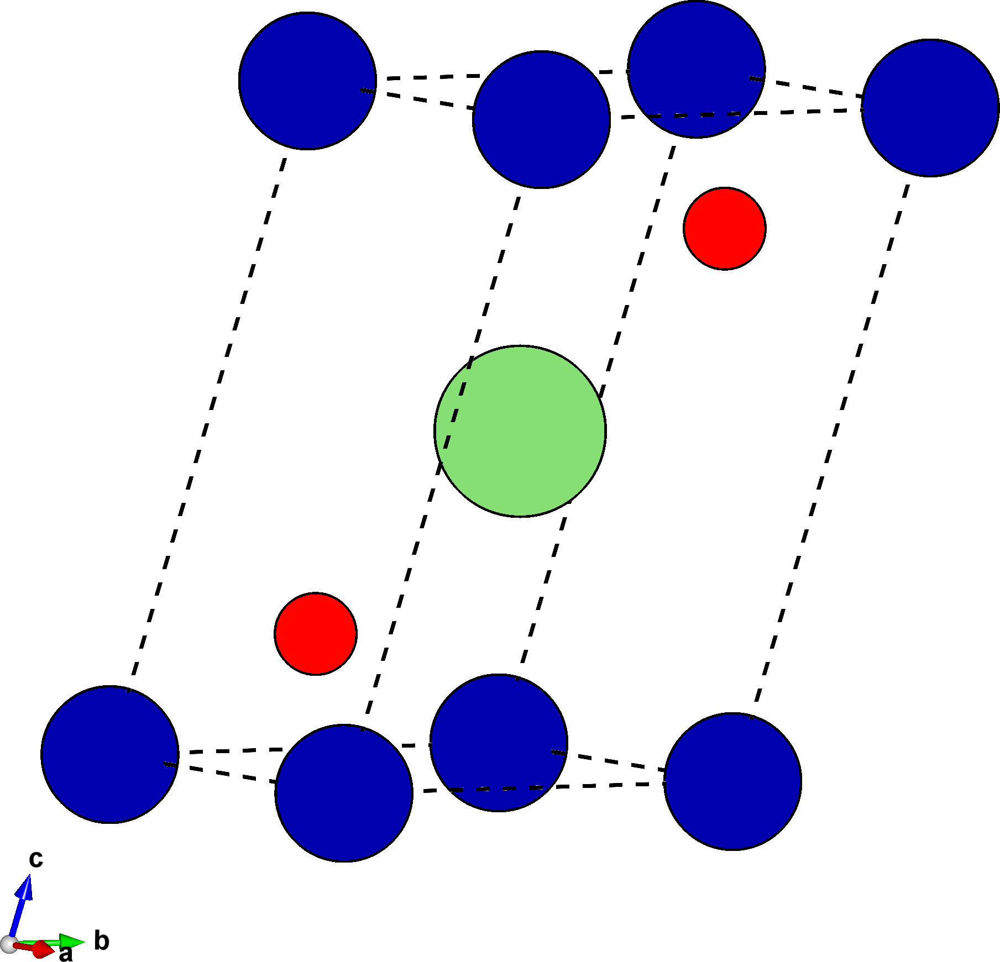



# Tutorial II: UBER of a layered structure
UBER curves are constructed by calculating the energy associated with separating two large slabs of material from each other.
In this tutorial we'll use `multishift-base` and `multishift-shift` to create a slab structure for $$\mathrm{LiCoO_2}$$ with varying amounts of spacing between the periodic images.
We will also explore how the "floor_slab_index" setting can be used to alter the atomic layer exposed at the ab-plane.

## LiCoO<sub>2</sub> unit cell
Download the primitive cell for $$\mathrm{LiCoO_2}$$ [here](./licoo2.vasp), or create a file called `licoo2.vasp` with the following crystallographic data:

    multishifter tutorial ii
    1.00000000
                           2.90741584       0.00000000       0.00000000
                           1.45370792       2.51789597       0.00000000
                           1.45370792       0.83929866       5.11697211
    Co Li O 
    1 1 2 
    Direct
                   0.0000000   -0.0000000    0.0000000
                   0.5000000    0.5000000    0.5000000
                   0.2700203    0.2700203    0.1899392
                   0.7299797    0.7299797    0.8100608

As shown below, the structure is a layered material.
The goal is to create a series of slabs of this material with varying amount of space inserted between the $$\mathrm{CoO_2}$$ layers.
The surface of interest is therefore along the $$(0,0,1)$$ direction.

| {:width="100%"} | {:width="100%"} |

## Slab settings and flooring
In the same working directory where you saved `licoo2.vasp`, [save the following](./uber.json) settings as `uber.json`:
```json
{
    "name" : "uber_tutorial",
    "base":
    {
        "prim" : "./licoo2.vasp",
        "millers" : [0,0,1],
        "stacks" : 3
    }
}
```
The settings specify that the plane we want to pull the slabs perpendicular to is the $$(0,0,1)$$ plane, and the smallest unit that exposes this plane should be stacked 4 times.
In this case, the primitive cell already has the ab-vectors oriented within the cleavage plane.
Create the slab structure by running
```bash
multishift-base -s uber.json
```
and inspect `final_slab.vasp`.

Though the cleavage plane and stacking is correct, this structure cannot be used as input for `multishift-shift` for the UBER calculations we are interested in.
When generating structures with cleavage between the slabs, we want to insert space between the $$\mathrm{CoO_2}$$ layers, but with the current position of the basis, space will be inserted within the top $$\mathrm{CoO_2}$$ layer.
`multishift-shift` will insert space at the *top of the slab*.
We must therefore translate the entire basis so that the correct atomic layer is exposed, which we would have if the $$\mathrm{Li}$$ atoms were at the origin instead of the $$\mathrm{Co}$$ atoms.
For this we use "floor_slab_index".
This key specifies the index (starting at 1) of an atom inside the slab structure.
`multishift-base` will translate the entire basis so that the specified atom is at the origin.
By selecting the index of a $$\mathrm{Li}$$ atom (PRO tip: click the atom in VESTA for this), we can create an adequate slab.
Add the entry to your settings:
```json
{
    "name" : "uber_tutorial",
    "base":
    {
        "prim" : "./licoo2.vasp",
        "millers" : [0,0,1],
        "stacks" : 3,
        "floor_slab_index" : 4
    }
}
```
Now run `multishift-base` again:
```bash
rm -r uber_tutorial.base
multishift-base -s uber.json
```
When flooring is requested, you will notice that the outputs of `raw_slab.vasp` and `final_slab.vasp` are different.
`raw_slab.vasp` is the slab constructed directly from the primitive cell without basis translation (bottom left), while `final_slab.vasp` is the same structure as `raw_slab.vasp` after translating the basis (bottom right).

| {:width="100%"} | {:width="100%"} |

## Cleave the slab
We now have a slab to give `multishift-shift`, which will create a set of structures with varying amounts of cleavage in them.
Add a "shift" entry to your `uber.json` settings file to specify the location of the slab structure, and different cleavage values in $$\AA$$.
Negative values will bring the slabs closer together, while positive values will insert space between the slabs.
```json
{
    "name" : "uber_tutorial",
    "base":
    {
        "prim" : "./licoo2.vasp",
        "millers" : [0,0,1],
        "stacks" : 3,
        "floor_slab_index" : 4
    },
    "shift":
    {
        "slab": "./uber_tutorial.base/final_slab.vasp",
        "cleavage": [-0.5, -0.3, -0.1, 0.0, 0.1, 0.3, 0.5, 1.0, 2.0]
    }

}
```
Run `multishift-shift` to create a structure for each cleavage value:
```bash
multishift-shift -s uber.json
```
This will create a set of directories within `uber_tutorial.shift` that contain each of cleaved structures.
The cleavage value is encoded within the directory structure itself, but there is also the file `record.json` that maps cleavage values to the path of each structure.
A copy of the slab structure used as input is also saved as `slab.vasp`.
