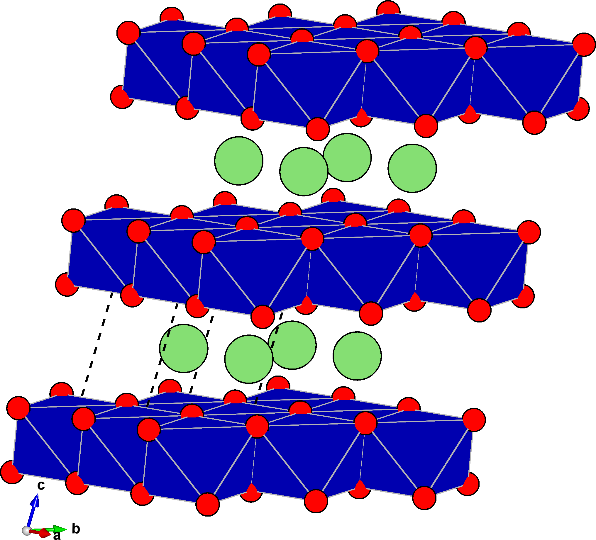



<style type="text/css">

</style>

# Tutorial II.a: Stacking a slab
In this tutorial we'll use `multishift stack` to create a thicc slab of $$\mathrm{LiCoO_2}$$.
Slabs created using this method serve as input for $$\gamma$$-surface construction, decohesion calculations, and twisted bilayers.
We'll also explore how `multishift translate` can be used to specify which atomic layer should be brought to the surface of the unit cell.

## LiCoO<sub>2</sub> unit cell
Download the primitive cell for $$\mathrm{LiCoO_2}$$ [here](./licoo2.vasp), or create a file called `licoo2.vasp` with the following crystallographic data:

    multishifter tutorial ii
    1.00000000
                           2.90741584       0.00000000       0.00000000
                           1.45370792       2.51789597       0.00000000
                           1.45370792       0.83929866       5.11697211
    Co Li O 
    1 1 2 
    Direct
                   0.0000000   -0.0000000    0.0000000
                   0.5000000    0.5000000    0.5000000
                   0.2700203    0.2700203    0.1899392
                   0.7299797    0.7299797    0.8100608

As shown below, the structure is a layered material, and the surface of interest $$(0,0,1)$$ is already parallel to the $$ab$$ vectors, so no slicing is necessary.

| {:width="100%"} | {:width="100%"} |

## Stack the structure
We'll create a slab that is 5 units thick.
In order to do this, run

```bash
multishift stack --inputs licoo2.vasp licoo2.vasp licoo2.vasp licoo2.vasp licoo2.vasp --output licoo2_stack5.vasp
```

The resulting structure has the same orientation as the input, but is repeated 5 times along the $$c$$ direction.
This type of structure is referred to as a _slab_ throughout future tutorials and documentation.
When generating structures relevant to 2d defects such as $$\gamma$$-sufraces, decohesion curves, or twisted structures, the targeted surface will always be the plane spanned by the $$ab$$ vectors.
Because of this, there is an additional degree of freedom left to resolve: rigid translation of the crystal basis.

Inspection of `licoo2_stack5.vasp` reveals that the plane spanned by the $$ab$$ vectors is penetrating the $$\mathrm{CoO_2}$$ octahedra.
A $$\gamma$$-surface of interest would probably go between the octaheral layers, not through them.
This problem is remedied by `multishift translate`.

## Translate the basis
There are two ways to translate the basis: either spefifying a shift vector (accepted as both Cartesian or fractional), or specifying the index of a basis atom.
When specifying an index, a translation will be applied that brings that basis atom to the origin.
Note that indexing of the basis begins at 1 *not* 0 (PRO tip: use VESTA to click on the atom you want, the given index will be in the right format).

<div class="note">
<b>Pro tip:</b>
<br>You can visualize your structure in VESTA and click on the desired atom to get the index in the right format.
Remember that indexing begins at 1, not 0!
<br>
</div>
<div>
<br>
</div>

For our example we'll select a $$\mathrm{Li}$$ atom, such as atom 8:

```bash
multishift translate --input licoo2_stack5.vasp -floor 8 --output licoo2_stack5_floor8.vasp
```

The figure below shows the difference between the slab structure before (left) and after translating (right).
After the translation has been applied, the $$ab$$ plane goes between the octahedral layers.

| {:width="80%"} | {:width="80%"} |

# Tutorial II.b: Stacking a heterostructure
We can also choose to combine two different chemistries to create a heterostructure.
We'll use [h-BN](./BN.vasp) and [graphite](../i/graphite_sliced.vasp) from [the previous tutorial](../i) as an example, or you can make the files yourself using the following data:

`BN.vasp`:

    B2 N2
    1.0
            2.5124282837         0.0000000000         0.0000000000
           -1.2562141418         2.1758267189         0.0000000000
            0.0000000000         0.0000000000         7.7072649002
        B    N
        2    2
    Direct
         0.666666729         0.333333362         0.750000031
         0.333333368         0.666666724         0.250000000
         0.666666729         0.333333362         0.250000000
         0.333333368         0.666666724         0.750000031

`graphite_sliced.vasp`:

    graph slice
    1.00000000
         2.46835383      0.00000000      0.00000000
        -1.23417691      2.13765712      0.00000000
        -0.00000000      0.00000000     12.06105428
    C 
    6 
    Direct
         0.00000000      0.00000001      0.16666800 
         0.66666667      0.33333334      0.83333466 
         0.33333333      0.66666668      0.50000133 
         0.00000002      0.00000008      0.83333199 
         0.66666668      0.33333341      0.49999865 
         0.33333335      0.66666675      0.16666532 

Starting from the bottom of the stack, you can specify any stacking sequence.
An alternating sequence of h-BN and graphite unit cells can be created with the following command:

```bash
multishift stack -i BN.vasp graphite_sliced.vasp -o hetero_BN-C.vasp
```

If different repetitions of a particular unit are desired, the same input file can be given more than once like we did in the first section.
For example, if we want to have two h-BN units followed by a single graphite unit, we can do the following:

```bash
multishift stack -i BN.vasp BN.vasp graphite_sliced.vasp -o hetero_BN-BN-C.vasp
```

<div class="warning">
<b>WARNING:</b>
<br>The final lattice vectors will always be taken from the first structure in the list.
Subsequent structures will be strained as necessary so that they share the same in plane vectors!
Stacking always occurs along the <i>c</i> direction for every structure, which can be easily reoriented with the <i>slice</i> command.
<br>
</div>
<div>
<br>
</div>
