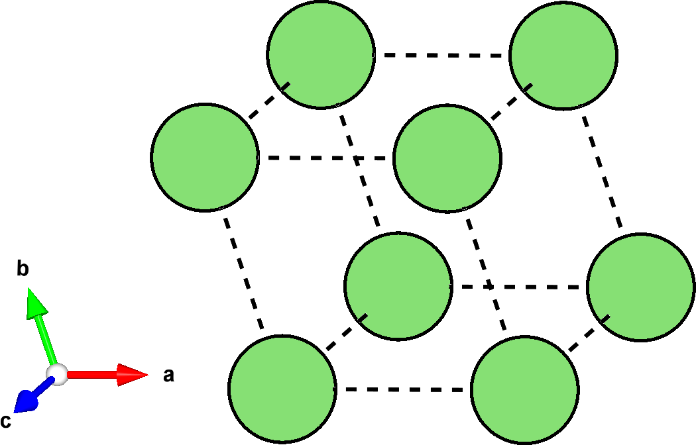
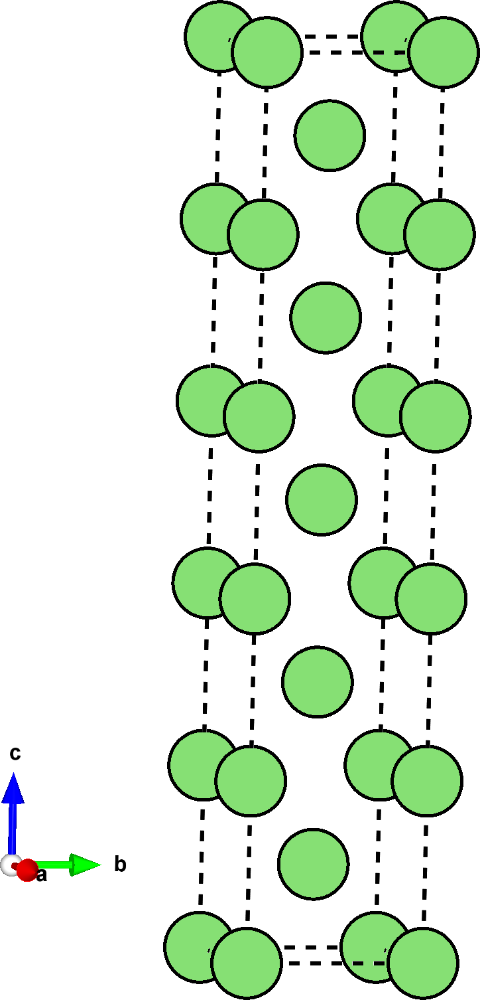
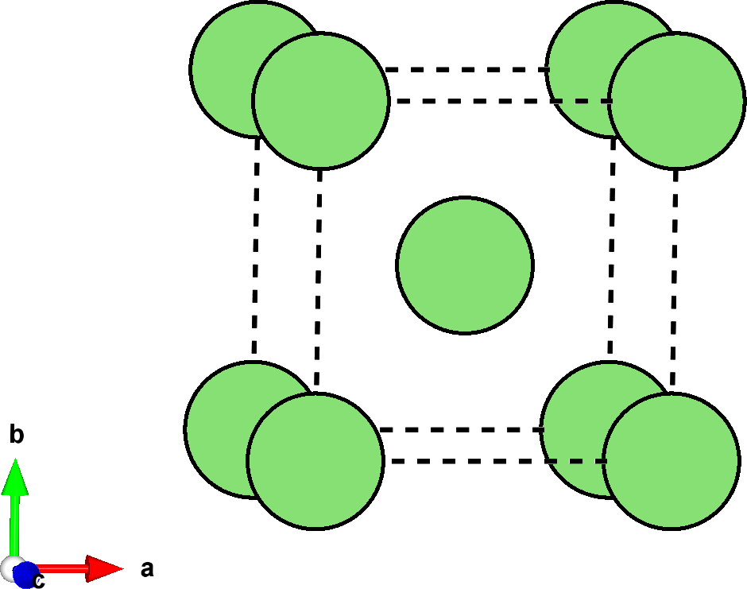
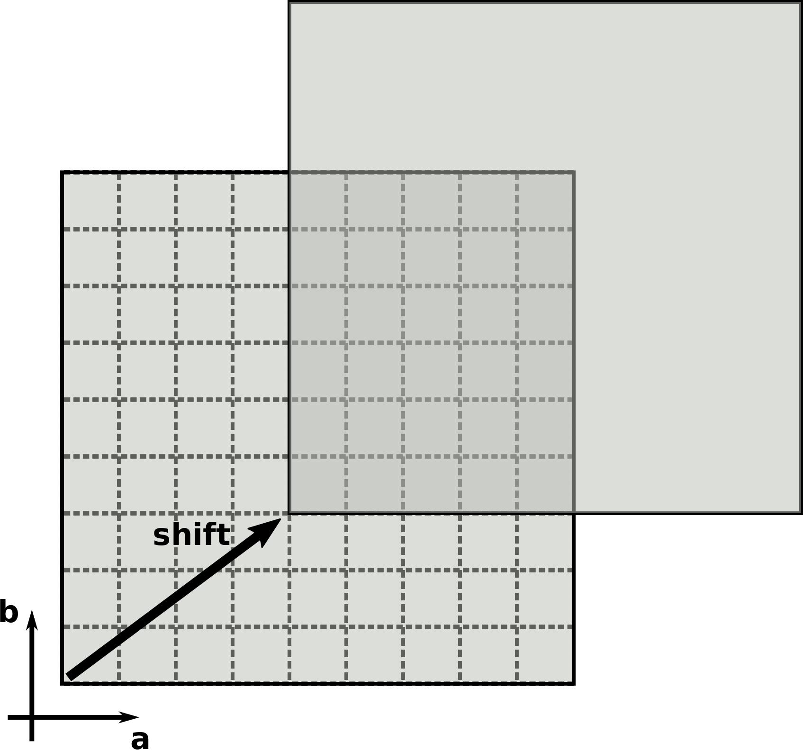
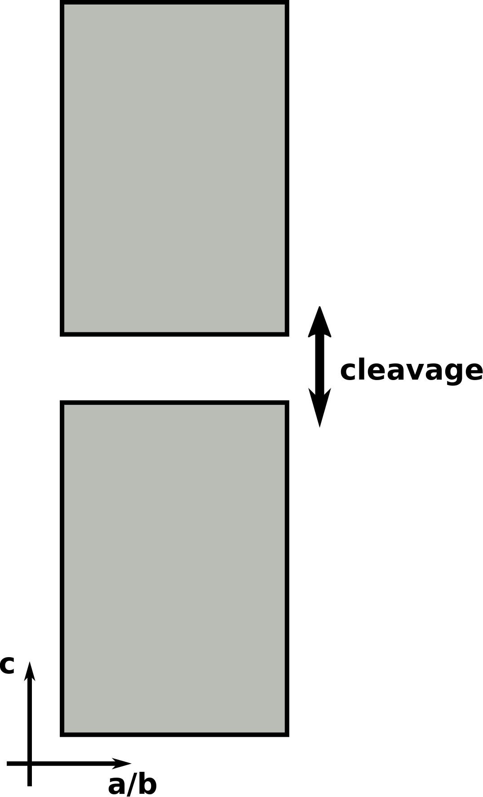
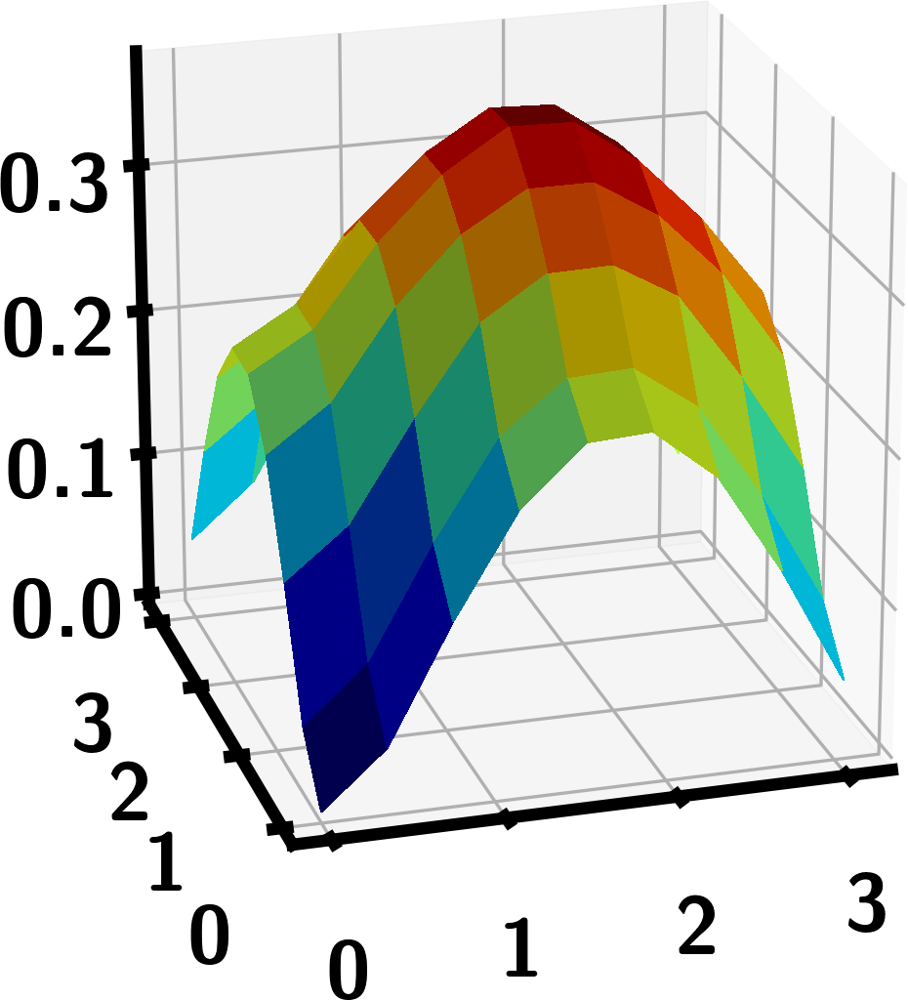
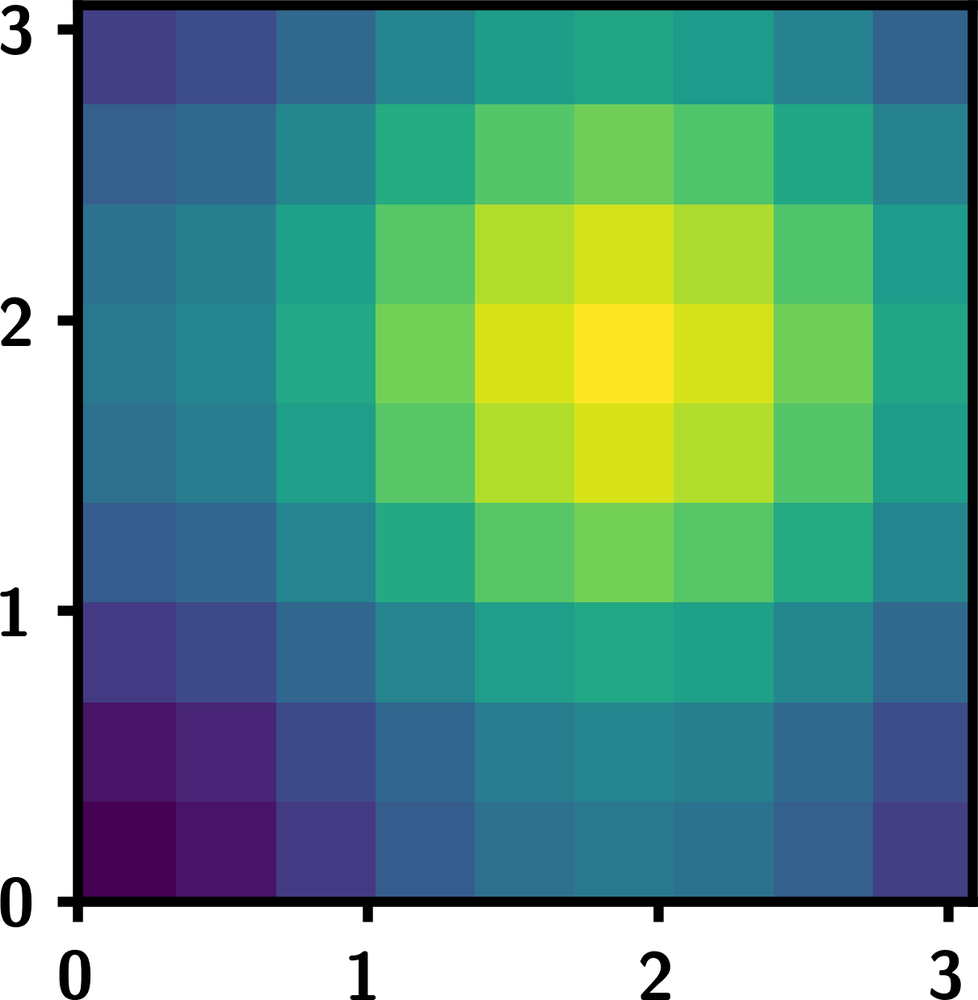
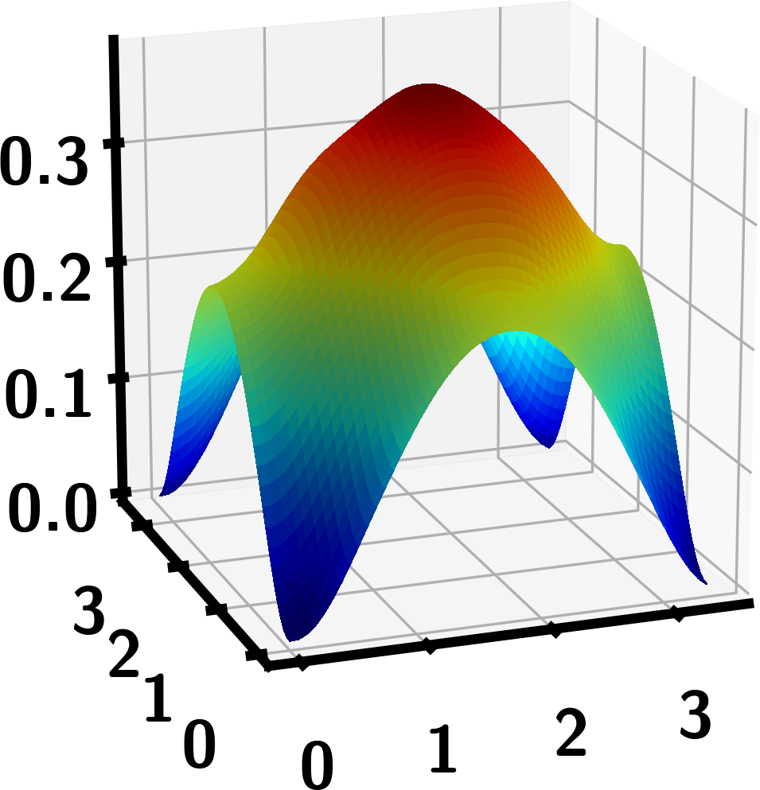
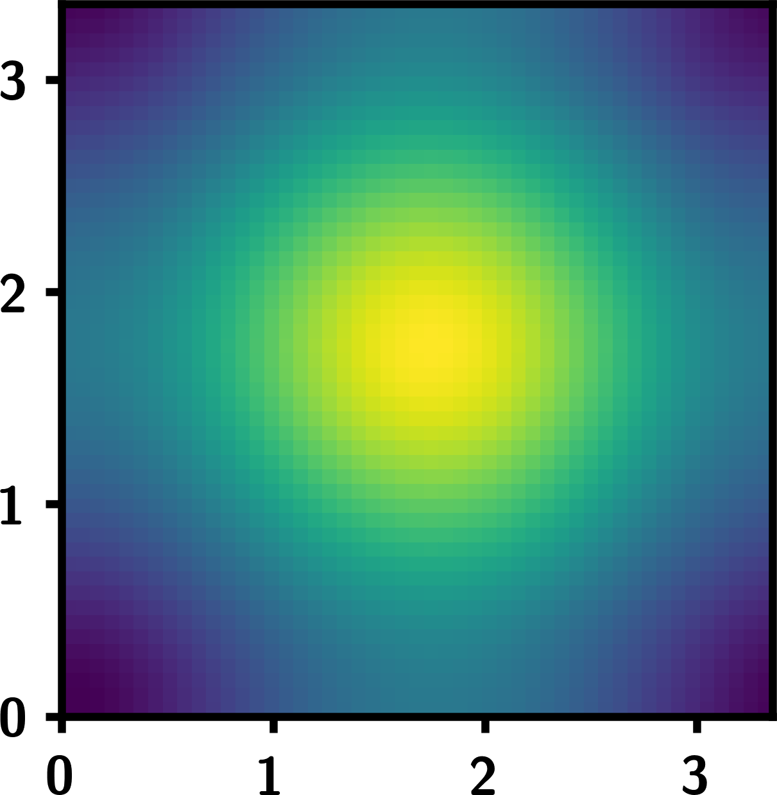



# Tutorial III: A $$\gamma$$-surface for Li
$$\gamma$$-surfaces are constructing by sliding slabs of Li along a slip plane.
For each of these slip values, energies at different cleavage values are calculated.
Taking the lowest energy for each of these cleavages yields one energy for each slip, which makes up the $$\gamma$$-surface.

In this tutorial we'll use `multishift-base` and `multishift-shift` to create slipped and cleaved structures to be calculated with DFT.
We'll then parameterize the DFT values with plane waves using `multishift-fourier`, for smooth interpolation of the $$\gamma$$-surface.

## Li primitive and slab cells
Download the primitive cell for $$\mathrm{Li}$$ [here](./li.vasp), or create a file called `li.vasp` with the following crystallographic data:

    multishifter tutorial iii
    1.0
            2.9677107334         0.0000000000         0.0000000000
           -0.9892369741         2.7979844900         0.0000000000
           -0.9892369741        -1.3989923786         2.4231255706
       Li
        1
    Direct
         0.000000000         0.000000000         0.000000000

This is the primitive BCC structure of Li that we'll construct a $$\gamma$$-surface for.
The slip plane we are interested is the $$(1,0,0)$$ direction of the conventional cell, which corresponds to the $$(1,-1,1)$$ direction in the primitive cell.

In the same working directory where you saved `li.vasp`, [save the following](mush.json) settings, or copy the following as `mush.json`:
```json
{
    "name" : "gamma",
    "base":
    {
        "prim" : "./li.vasp",
        "millers" : [1,-1,1],
        "slab_floor_index" : 0,
        "stacks" : 5
    }
}
```
and run `multishift-base`:
```bash
multishift-base -s mush.json
```

This will create a stack of 5 conventional BCC cells along the $$c$$-direction, referred to as the *slab structure*, which is covered in [Tutorial I](../i).
The primitive structure, shift unit, and slab structure are shown below, all of them located in `gamma.base`.

<div>
<table>
  <tr>
    <th></th>
    <th rowspan="2"></th>
  </tr>
  <tr>
    <td></td>
  </tr>
</table>
</div>

## Creating shifted and cleaved structures
Next we will use the final slab structure that was just generated as a starting point to create shifted slabs.
The slabs are always shifted along the $$ab$$-plane of the unit cell.
For the slab we created, this gives a square unit cell along which to shift the slabs.
We will grid up this surface into a $$9\times 9$$ grid, where each point represents a sliding vector relative to the unperturbed slab at the origin.
Additionally, for each of these shifts, we will insert varying amounts of cleavage between the slabs themselves, as covered in [Tutorial II](../ii).

| {:width="100%"} | {:width="100%"} |

In order to create the structures, update the `mush.json` settings file to specify the following:
```json
{
    "name" : "demo",
    "base":
    {
        "prim" : "./li.vasp",
        "millers" : [1,-1,1],
        "slab_floor_index" : 0,
        "stacks" : 5
    },
    "shift":
    {
        "slab" : "./demo.base/final_slab.vasp",
        "a" : 9,
        "b" : 9,
        "cleavage" : [-0.5, -0.3, -0.1, 0.0, 0.1, 0.3, 0.5, 0.7, 1.0, 1.5, 2.0, 2.5, 3.0, 4.0, 5.0, 6.0]
    }
}
```
and run `multishift-shift`:
```bash
multishift-shift -s mush.json
```

This will create a directory named `gamma.shift`, where all of the shifted slab structures are located.
The directories naming indicates how much shift and cleavage was applied to the original slab structure, where `shift_0.0/cleave_0.000000` corresponds to the unperturbed slab.
Exact values of the shift vector in Cartesian coordinates are stored in `record.json`, along with other relevant data, and a backup of the settings and starting slab structure are stored in `shift.json` and `slab.vasp` respectively.

## Gather DFT results
Once you've calculated DFT energies of every structure, you are ready to collect the data to create the $$\gamma$$-surface.
Using `record.json` as a starting point, include a new entry called `energy`, where you store the DFT energy for each structure and save it as `full_record.json`.
In order to construct the $$\gamma$$-surface, we only want one energy per shift value.
Using `full_record.json`, reduce the number of values at each shift point by retaining only the cleavage value with the minimum energy at that shift, and save the content in `reduced_record.json`.
You can download a `full_record.json` file (calculated with VASP) and the corresponding `reduced_record.json` [here](./full_record.json) and [here](reduced_record.json).

<!-- TODO: write another tutorial on using sidekick and plot, then link it here -->

You can now visualize the $$\gamma$$-surface by plotting the values `x_cart` and `y_cart` vs `energy` in the `reduced_record.json`.

| {:width="100%"} | {:width="70%"} |

## Apply Fourier interpolation
You can smoothen out your data by reconstructing the $$\gamma$$-surface in terms of plane waves.
In order to do this, update `mush.json` to contain the following:
```json
{
    "name" : "gamma",
    "base":
    {
        "prim" : "./li.vasp",
        "millers" : [1,-1,1],
        "slab_floor_index" : 0,
        "stacks" : 5
    },
    "shift":
    {
        "slab" : "./gamma.base/final_slab.vasp",
        "a" : 9,
        "b" : 9,
        "cleavage" : [-0.5, -0.3, -0.1, 0.0, 0.1, 0.3, 0.5, 0.7, 1.0, 1.5, 2.0, 2.5, 3.0, 4.0, 5.0, 6.0]
    },
    "fourier":
    {
        "data":"./reduced_record.json",
        "lattice":"./gamma.shift/slab.vasp",
        "values":["energy"]
    }
}
```
and run `multishift-fourier`:
```bash
multishift-fourier -s mush.json
```

This creates the directory `gamma.fourier`, where several files are saved:
* `data.json` is a backup of the original data (in this case `reduced_record.json`.
* `energy.real.json` is the energy values at each of the grid points, this is the $$\gamma$$-surface itself.
* `energy.rcal.json` is the Fourier coefficients for the energy values in reciprocal space.
* `lattice.vasp` is a structure with the appropriate lattice the values are interpolate on (in this case the slab we created earlier).
* `fourier.json` is a backup of the settings used for the Fourier step.
* `energy.interpolator.json` contains all the information necessary to interpolate the energy values.

Interpolation can be done on multiple values, by giving more than one entry in the `values` section of the settings.
For this tutorial we are only concerned with the values of the energy at each shift, which we can interpolate to a $$50\times 50$$ resolution by calling
```bash
multishift-fourier --interpolate 50x50 --interpolator gamma.fourier/energy.interpolator.json -o ipol.json
```
The output is saved to the file specified in the last argument `ipol.json`, which can be plotted to visualize a smooth $$\gamma$$-surface.

| {:width="100%"} | {:width="70%"} |
