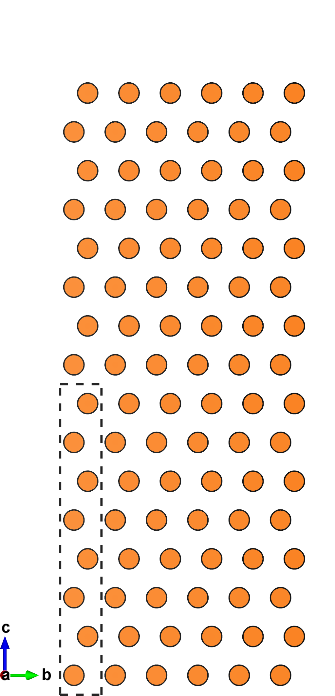
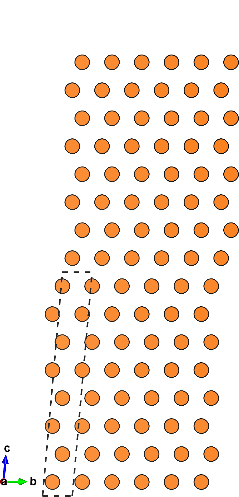
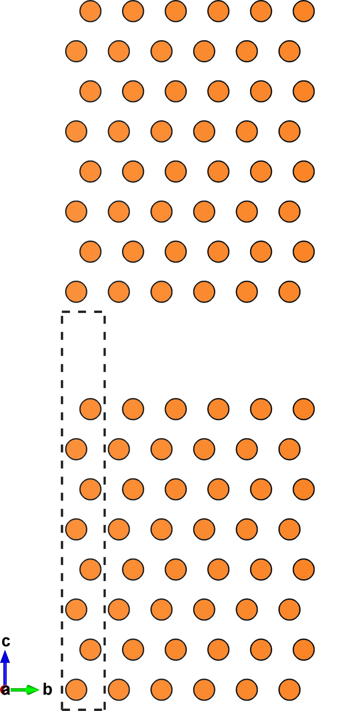



<style type="text/css">

</style>

# Tutorial III.a: Creating a stacking fault
In this tutorial we'll use `multishift mutate` to create a stacking fault in $$\mathrm{Mg}$$.

## Mg slab cell
We'll start with a slab of $$\mathrm{Mg}$$ with 8 atomic layers (4 unit cells tall).
You can download it [here]("./mg_stack4.vasp), or create a file called `mg_stack4.vasp` yourself with the follwing data:

    Mg stack
    1.00000000
       1.59609453    2.76451683    0.00000000
      -1.59609453    2.76451683    0.00000000
       0.00000000    0.00000000   20.73607828
    Mg
    8
    Direct
       0.66666670    0.66666670    0.18750000 Mg
       0.33333330    0.33333330    0.06250000 Mg
       0.66666670    0.66666670    0.43750000 Mg
       0.33333330    0.33333330    0.31250000 Mg
       0.66666670    0.66666670    0.68750000 Mg
       0.33333330    0.33333330    0.56250000 Mg
       0.66666670    0.66666670    0.93750000 Mg
       0.33333330    0.33333330    0.81250000 Mg

You can also create your own slab from a primitive cell using `multishift stack`, as explained in a [previous tutorial](../ii).

## Create a stacking fault
The `mutate` command will transform the input structure by modifying its lattice, while retaining the Cartesian coordinates of the basis.
This is done by adding a specified vector to the $$c$$ lattice vector of the structure.

We can create a stacking fault by shifting two of the $$\mathrm{Mg}$$ slabs relative to each other by $$(\frac{2}{3},\frac{2}{3})$$ relative to each other along the basal plane using fractional coordinates.
This value can be passed to `multishift mutate`, to create a periodic structure of staggered slabs, with a stacking fault at the boundary of each periodic image:

```bash
multishift mutate --input mg_stack4.vasp --mutation 0.6666666 0.6666666 0.0 --fractional --output mg_stack4_fault.vasp
```

A comparison of the input (left) and output (right) structures is shown below.
Notice the stacking sequence change at the $$ab$$-plane of the slab.
By retaining the Cartesian coordinates of the basis while changing the lattice of the unit cell, the periodicity breaks at the boundary, creating staggered cells.

| {:width="80%"} | {:width="80%"} |

# Tutorial III.b: Exposing a surface
The same command can be used to separate the slabs away from each other, which is useful for calculating surface energies.
The procedure is the same as for creating a stacking fault, except the given vector will now point perpendicular to the $$ab$$-plane.
Instead of using fractional coordinates, we'll specify the value directly in Cartesian to add $$5\AA$$ of vacuum between slabs:

```bash
multishift mutate --input mg_stack4.vasp --mutate 0.0 0.0 5.0 --output mg_stack4_cleave.vasp
```

A comparison of the input (left) and output (right) structures is shown below.

| {:width="80%"} | {:width="80%"} |


`multishift mutate` will add any mutation to the $$c$$ vector of your lattice, so you can simultaneously shift and cleave your slabs apart.

<div class="warning">
<b>WARNING:</b>
<br>Be mindful when using Cartesian values for your mutation, as they will be added as is to the third lattice vector.
For this case it is recommended you put your structure through the <i>align</i> command, which will make the mutation value more intuitive.
<br>
</div>
<div>
<br>
</div>
