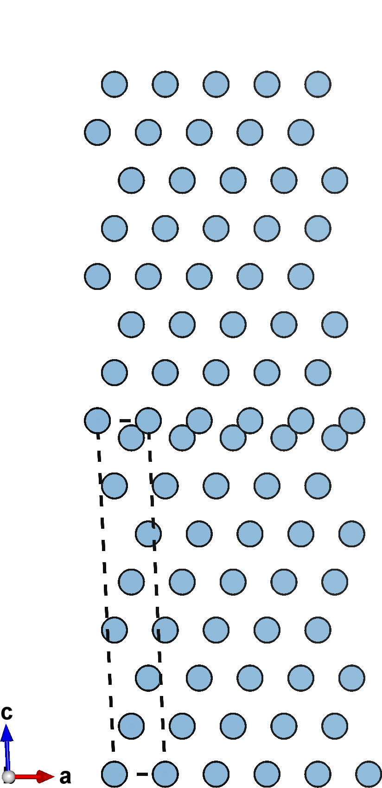
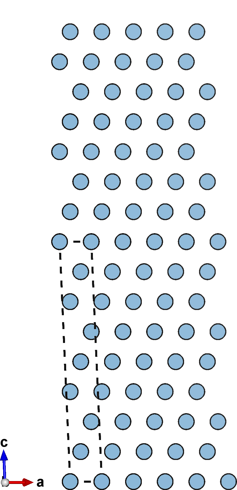
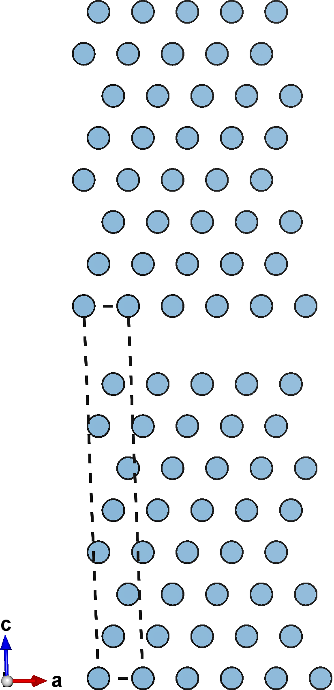
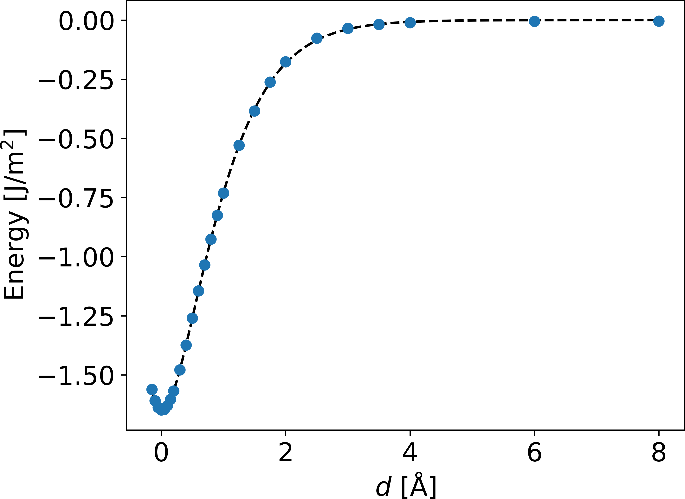



<style type="text/css">

</style>

# Tutorial IV: Cleaving for UBER
In this tutorial we'll use `multishift cleave` to generate many slab structures separated by varying amounts of empty space from each other.
Calculations of these structures can be used to determine how surface energy changes as a function of slab separation.

## Al slab cell
We'll start with a slab of $$\mathrm{Al}$$ with 8 atomic layers.
The exposed surface is the $$(1,1,1)$$ plane of the conventional cell, which is just the $$(0,0,1)$$ direction of the primitive cell.
You can download it [here]("./al_stack8.vasp), or create a file called `al_stack8.vasp` yourself with the follwing data:

    Al stack
    1.00000000
         2.85595465      0.00000000      0.00000000
         1.42797732      2.47332928      0.00000000
        -0.00000000      1.64888618     18.65501764
    Al
    8
    Direct
         0.00000000      0.00000000      0.00000000 Al
         0.37500000      0.25000000      0.12500000 Al
         0.75000000      0.50000000      0.25000000 Al
         0.12500000      0.75000000      0.37500000 Al
         0.50000000     -0.00000000      0.50000000 Al
         0.87500000      0.25000000      0.62500000 Al
         0.25000000      0.50000000      0.75000000 Al
         0.62500000      0.75000000      0.87500000 Al


You can also create your own slab from a primitive cell using `multishift stack`, as explained in a [previous tutorial](../ii).

## Cleave your slab
The `cleave` command takes a list of separation distances in $$\AA$$ that will be inserted between the periodic images of the starting slab.
We'll give 3 different values, and specify `al_cleave` as the directory where everything should be written to:

```
multishift cleave --input al_stack8.vasp --values -1.5 0.0 2.0 --output al_cleave
```

Once you've run this command, the output directory `al_cleave` will be created, which has the following structure:

```bash
al_cleave
├── slab.vasp
├── record.json
├── cleave__2.000000
│   └── POSCAR
├── cleave__-1.500000
│   └── POSCAR
└── cleave__0.000000
    └── POSCAR
```

The first file `slab.vasp` is simply a backup of the input structure `al_stack8.vasp`.
The second file `record.json` holds a short description for each of the generated structures, and is described in detail [in a separate tutorial](../ix).
The generated structures are each saved to an idividual directory named `cleave__*`, with the cleavage value fromatted into the directory name.

A negative cleavage value (left) causes the slabs to compress into each other, reducing the spacing between them.
A null cleavage value (center) does nothing, and the output structure is simply an unperturbed copy of the input slab.
A positive cleavage value (right) inserts space bewtween the slabs, separating them away from each other.


| {:width="100%"} | {:width="100%"} | {:width="100%"} |

## A worked example
With enough cleavage values, you can fit an UBER curve.
The following command generates 26 cleavage values, with smaller increments concentrated around the equilibrium distance.
`multishift` requires that output directories be named something nonexistent in the working directory.

```bash
rm -r al_cleave
multishift cleave --input al_stack8.vasp --output al_cleave --values -0.15 -0.1 -0.05 0.0 0.05 0.1 0.15 0.2 0.3 0.4 0.5 0.6 0.7 0.8 0.9 1.0 1.25 1.5 1.75 2.0 2.5 3.0 3.5 4.0 6.0 8.0
```

The image below shows the energy values of each structure calculated with DFT, as a function of separation distance for the $$Al$$ slab.
As the cleavage value increases, the energy converges to twice the value of the surface energy of the material (two surfaces per slab).
The [data for these calculations](./al_cleave.26.data.zip) and [the script used for the plot](./uberplot.py) are avaiable for you to download.

<p align="center">
  
</p>
