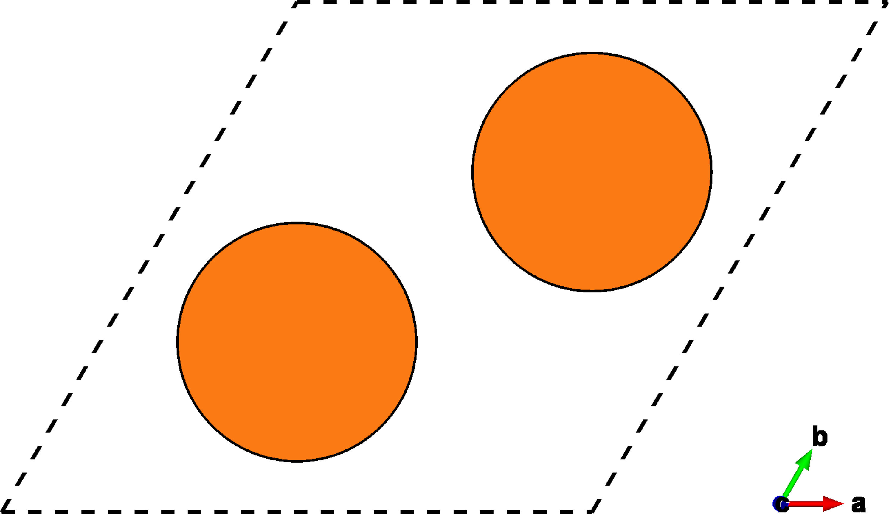
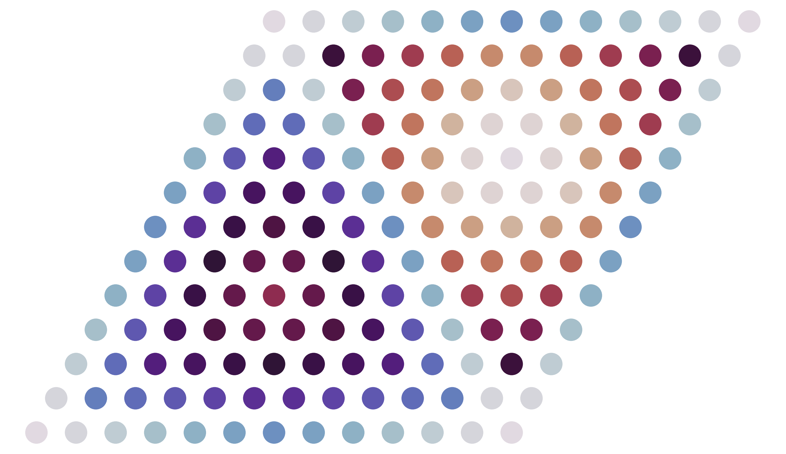



<style type="text/css">

</style>

# Tutorial V: Shifting for $$\gamma$$-surfaces
In this tutorial we'll use `multishift shift` to generate many slab structures that have been shifted along the $$ab$$-plane of their unit cell (glide plane).
Calculations of these structures can be used to calculate $$\gamma$$-surfaces.

## Mg slab cell
We'll start with a slab of $$\mathrm{Mg}$$ with 8 atomic layers (4 unit cells tall).
This is the same slab from the [`mutate` tutorial](../iii).
You can download it [here]("./mg_stack4.vasp), or create a file called `mg_stack4.vasp` yourself with the follwing data:

    Mg stack
    1.00000000
       1.59609453    2.76451683    0.00000000
      -1.59609453    2.76451683    0.00000000
       0.00000000    0.00000000   20.73607828
    Mg
    8
    Direct
       0.66666670    0.66666670    0.18750000 Mg
       0.33333330    0.33333330    0.06250000 Mg
       0.66666670    0.66666670    0.43750000 Mg
       0.33333330    0.33333330    0.31250000 Mg
       0.66666670    0.66666670    0.68750000 Mg
       0.33333330    0.33333330    0.56250000 Mg
       0.66666670    0.66666670    0.93750000 Mg
       0.33333330    0.33333330    0.81250000 Mg

You can also create your own slab from a primitive cell using `multishift stack`, as explained in a [previous tutorial](../ii).

## Shift your slab
The `shift` command takes the dimensions of a grid that will be applied to the $$ab$$-plane of your slab.
Each grid point corresponds to a particular in plane shift or glide, and corresponds to a point on the $$\gamma$$-surface.
We'll give a $$3\times3$$ grid, for a total of 9 surface points.
The densities are given in the order $$a\times b$$, where $a$ and $b$ are the number of divisions that should be made along the $a$ and $b$ vectors of your slab.

```
multishift shift --input mg_stack4.vasp --grid 3 3 --output mg_shift
```

Once you've run this command, the output directory `al_shift` will be created, which has the following structure:

```bash
mg_shift/
├── slab.vasp
├── record.json
├── shift__2.2
│   └── POSCAR
├── shift__2.1
│   └── POSCAR
├── shift__2.0
│   └── POSCAR
├── shift__1.2
│   └── POSCAR
├── shift__1.1
│   └── POSCAR
├── shift__1.0
│   └── POSCAR
├── shift__0.2
│   └── POSCAR
├── shift__0.1
│   └── POSCAR
└── shift__0.0
    └── POSCAR
```

The first file `slab.vasp` is simply a backup of the input structure `al_stack8.vasp`.
The second file `record.json` holds a short description for each of the generated structures, and is described in detail [in a separate tutorial](../ix).
The generated structures are each saved to an idividual directory named `shift__*.*`, with the indexes of the grid point formatted into the directory name.

`shift__0.0` corresponds to the initial unperturbed slab.
Generally speaking, for a $$N\times M$$ grid, `shift__n.m` corresponds to an in plane shift vector $$(\frac{n}{N},\frac{m}{M})$$ in fractional coordinates relative to the slab $$ab$$ vectors.
This means `shift_2.2` has the slabs shifted by $$(\frac{2}{3},\frac{2}{3})$$, which is the same as the stacking fault we created in the [`mutate` tutorial](../iii).
The figures below show the structures of `shift__0.0`, `shift__1.1`, and `shift__2.2`.


| {:width="100%"} | {:width="100%"} | {:width="100%"} |

Notice that for this $$3\times 3$$ grid, the next structure that would appear in this sequence is `shift__3.3`.
This would be the same as `shift__0.0`, and so it is not outputted.

## Equivalent shifts
Due to the symmetry of the crystal, enumerating all the shifted slab structures on a grid often results in symmetrically equivalent structures.
In the $$3\times 3$$ $$\mathrm{Mg}$$ example we looked at, shifting purely along the $$a$$ vector is equivalent to shifting purely along the $$b$$ vector.
Therefore, we expect `shift__1.0` to be equivalent to `shift__0.1`.

This information is stored in `record.json`.
The format is explained in detail [here](../ix).
For our example, we find that there are just 4 orbits of slab structures.
This means we need only calculate DFT energies for for structures to get the energies of all 9.

If we repeat the enumeratation with a $$12\times 12$$ grid instead, we find there are 31 orbits, which is a lot less than the total 144 structures.
We can visualize the symmetry of the glide plane with some minor python skills.
[This script](./symplot.py) extracts the symmetry data from `record.json`, and plots the shift points, highlighting which orbit they each belong to with a different color.

| {:width="100%"} | {:width="100%"} |

<div class="note">
<b>Pro tip:</b>
<br>
Different grid densities can greatly alter the number of slab orbits, which influence how many calculations you need to perform.
Finding a "good" way to divide the grid can be especially tricky for lower symmetry unit cells.
You can save a lot of calculation time by playing around with different grid divisions to find a ratio that bins your slabs into fewer orbits.
<br>
</div>
<div>
<br>
</div>

