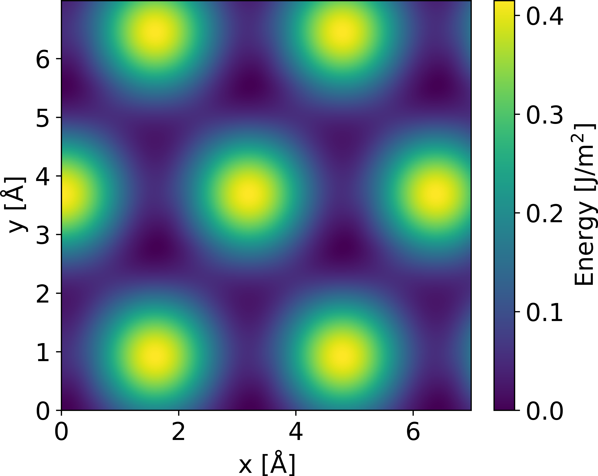



<style type="text/css">

</style>

# Tutorial VII: Fourier interpolation
In this tutorial we'll use `multishift fourier` to get analytical expressions for the calculated values of the [`shift`](../v) tutorial.


## Collecting data
The input format for the data is the same as the `record.json` that gets generated when you run `cleave`, `shift`, or `chain`.
In the [`shift`](../v) tutorial, we learned how to enumerate shifted structures, and looked at the symmetry for the basal plane of $$\mathrm{Mg}$$ on a $$12\times 12$$ grid.
After this step, the structures (remember that knowing the symmetry, you only need to calculate a subset of them!), get put through DFT caclulations.
You can download the results of calculations done with VASP [here](../v/mg_shift12x12.data.zip).

We now have 144 energy values for our $$\gamma$$-surface, one for each of the $$12\times 12$$ gridpoints.
We're going to smoothen these out to an arbitrary resolution with `multishift fourier`.
In order to do this, we need to modify the `report.json` file that got generated during the `shift` command.
Each generated structure has it's own entry in the file under the "ids" key.
Each entry has a series of values, which we will supplement with the energy values, using "dft_energy" as a key.
Below is a truncated version of the original `report.json`:

```json
{
    "cleavages": [ "..." ],
    "equivalents": [[ "..." ]],
    "grid": [
        12,
        12
    ],
    "ids": {
        "0:0:0.000000": {
            "cleavage": 0.0,
            "directory": "shift__0.0",
            "equivalent_structures": [
                "0:0:0.000000"
            ],
            "grid_point": [
                0,
                0
            ],
            "orbit": 0,
            "shift": [
                0.0,
                0.0
            ]
        },
        "..." : {"..."},
        "9:9:0.000000": {
            "cleavage": 0.0,
            "directory": "shift__9.9",
            "equivalent_structures": [
                "6:9:0.000000",
                "9:6:0.000000",
                "9:9:0.000000"
            ],
            "grid_point": [
                9,
                9
            ],
            "orbit": 27,
            "shift": [
                3.591212709318049,
                2.0733876166740566
            ]
        }
    },
    "shift_units": [[ "..." ]]
}
```

After you insert the energy entries, it will look like this (note the new "dft_energy" entry):

```json
{
    "cleavages": [ "..." ],
    "equivalents": [[ "..." ]],
    "grid": [
        12,
        12
    ],
    "ids": {
        "0:0:0.000000": {
            "cleavage": 0.0,
            "directory": "shift__0.0",
            "equivalent_structures": [
                "0:0:0.000000"
            ],
            "grid_point": [
                0,
                0
            ],
            "orbit": 0,
            "shift": [
                0.0,
                0.0
            ],
            "dft_energy": -12.771096
        },
        "..." : {"..."},
        "9:9:0.000000": {
            "cleavage": 0.0,
            "directory": "shift__9.9",
            "equivalent_structures": [
                "6:9:0.000000",
                "9:6:0.000000",
                "9:9:0.000000"
            ],
            "grid_point": [
                9,
                9
            ],
            "orbit": 27,
            "shift": [
                3.591212709318049,
                2.0733876166740566
            ],
            "dft_energy": -12.724973
        }
    },
    "shift_units": [[ "..." ]]
}
```

Fill the all the values in a copy of your `report.json`, and name the file `modified_record.json`.
The structure of `report.json` should make this straightforward, as is being done with [this script](./fill_record.py).
You can also download the complete modified record [here](./modified_record.json).

## Interpolate your data
We're ready to do our interpolation now:

```bash
multishift fourier --data modified_record.json --key "dft_energy"
```

You'll see a large function being printed to the screen.
This is the analytical expression of the $$\gamma$$-surface, which you can plot directly in python.
For interpolations of only real values, the "Imaginary functions" values should always be exactly zero.
A simple surface [plot](./surf.py) of the analytical expression is shown below.

<p align="center">
  
</p>

## Cleavage slices
If you've run the `chain` command, then the `record.json` file will have entries for the same shift at different cleavage values.
The interpolation can only work for one value per grid point, so you must select a "slice" of the data, where all the grid points have consistend cleavage values.
This is done with the `--cleavage-slice` flag:

```bash
multishift fourier --data modified_record.json --key "dft_energy" --cleavage-slice 0.0
```

The command above will take all the data with cleavage values equal to 0.0.

## Basis crushing
You can "crush" the basis functions whose coefficients fall below a certain threshold
By providing a magnitude to the `--crush` flag
Any basis function whose coefficient magninude is small enough will be dropped from the formula.
