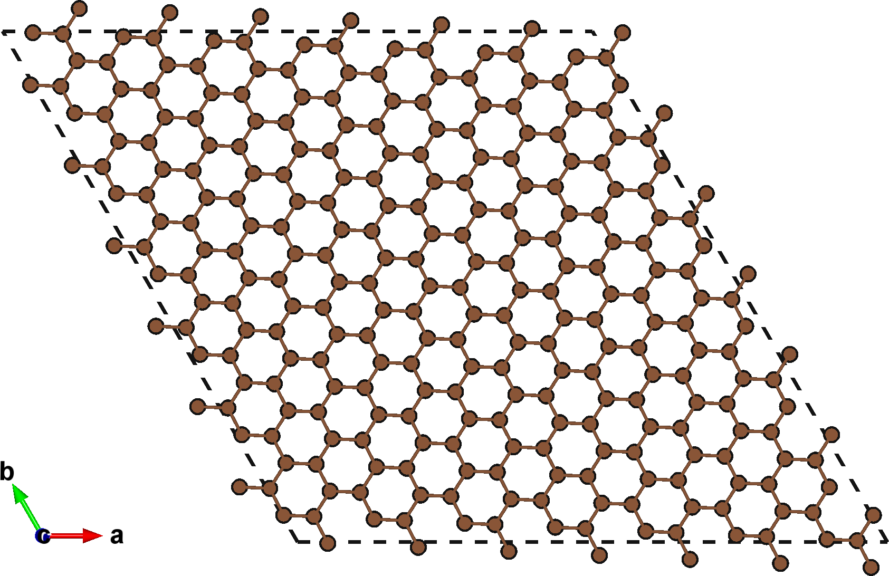
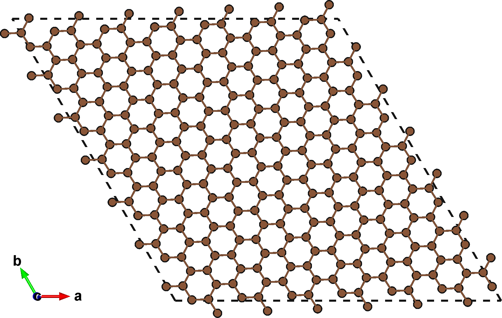
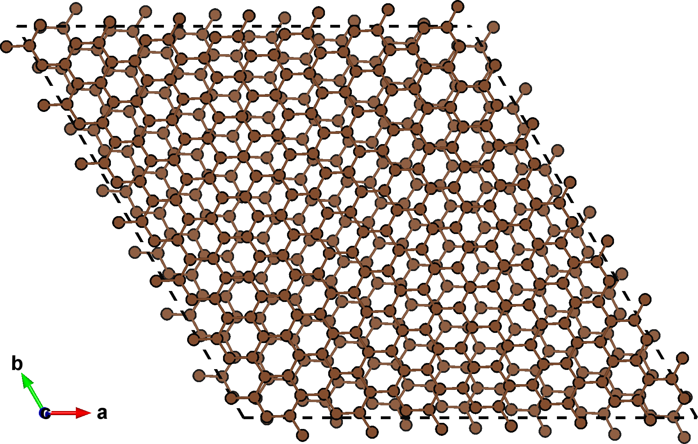
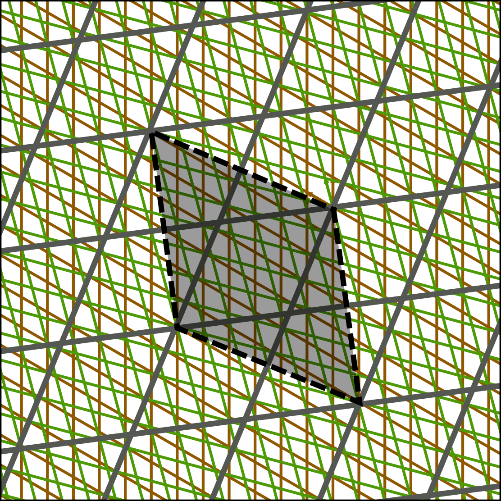
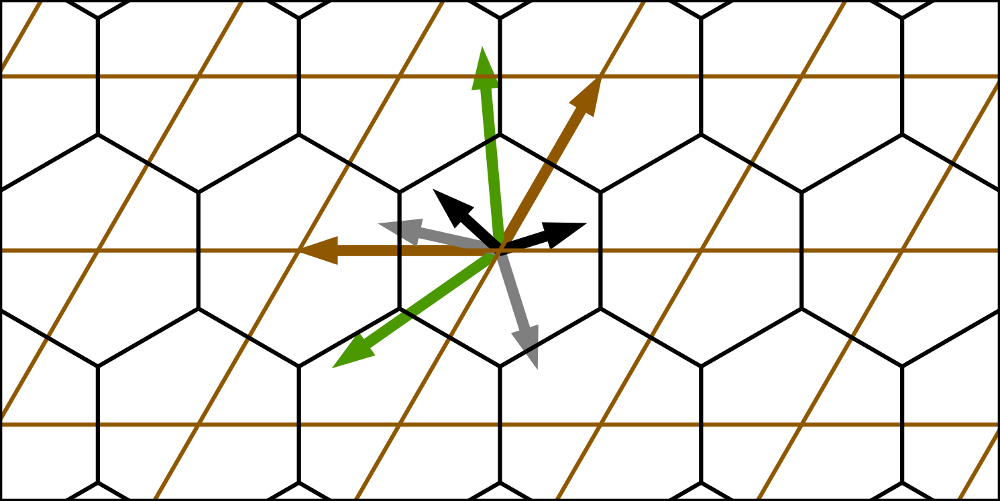
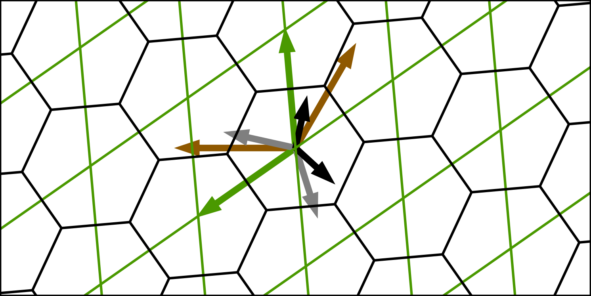



<style type="text/css">

</style>

# Tutorial VIII: Do the twist
In this tutorial we'll use `multishift twist` to create twisted bilayers of graphene for different rotation angles.
We'll explore angles for perfectly coincident structures, as well as arbitrary angles that result in some amount of deformation.


## Graphene slab
We'll start with a slab that has a single layer of graphene in it.
You can download the file [here](./graphene.vasp), or create a file called `graphene.vasp` yourself with the following data:

    C2
    1.0
            2.4684159756         0.0000000000         0.0000000000
           -1.2342079878         2.1377109420         0.0000000000
            0.0000000000         0.0000000000         9.9990577698
        C
        2
    Direct
         0.666666680         0.333333359         0.000000000
         0.333333357         0.666666718         0.000000000


## Choosing twist angles
Due to the semi-periodic nature of Moir&#233; lattices, not all twist angles can be perfectly represented with a periodic unit cell.
For our first step, we'll focus on two twist angles that result in perfectly coincident Moir&#233; lattices:
5.0858478081234 and 15.178178937949.
Run the following command to generate twisted layers for these angles:

```bash
multishift twist --input graphene.vasp --angles 5.0858478081234 15.178178937949 --output graph_twist
```

You'll now have a new directory called `graph_twist` with the follwing structure:

```bash
graph_twist/
├── record.json
├── slab.vasp
├── twist__15.178179
│   ├── bottom_layer.vasp
│   ├── bottom_tile.vasp
│   ├── top_layer.vasp
│   └── top_tile.vasp
└── twist__5.085848
    ├── bottom_layer.vasp
    ├── bottom_tile.vasp
    ├── top_layer.vasp
    └── top_tile.vasp
```

`slab.vasp` is an [aligned](../i) copy of the input structure, while `record.json` has a summary and analysis for each of the twist angles described in more detail in a [separate tutorial](../ix).
For now we'll focus on the `bottom_layer.vasp` and `top_layer.vasp` files.
These are the individual twisted bilayers, which we can combine into a single structure with the [stack](../ii) command.

```bash
multishift stack --input graph_twist/twist__5.085848/*layer.vasp --output stack.vasp
```

The individual structures and the stacked one are shown below.

| {:width="100%"} | {:width="100%"} | {:width="100%"} |

<div class="note">
<b>Pro tip:</b>
<br>
You don't have to stack the layers as they are.
You can always translate the basis, or mutate them (e.g. change the interlayer distance) with the appropriate commands covered in other tutorials.
If you want to apply the twist at a particular coordinate in the slab, you can also translate the basis to bring that coordinate to the origin.
<br>
</div>
<div>
<br>
</div>

## Allowing larger supercells
The 5.0858478081234 twist has the expected structures, but inspection of the 15.178178937949 twist shows a substantially distorted structure relative to the input slab.
If you measure the internal angles of the graphene hexagons of the layer structures, you'll find that they aren't $$120^\circ$$ anymore, but rather off by about $$2^\circ$$.
If the twist angle results in a perfectly commensurate structure, then there should be no distortion in the final structures.

Sometimes the coincident sites of the twisted bilayer aren't the same as the Moir&#233; lattice sites, but rather a supercell of the Moir&#233; lattice.
For the 15.178178937949, the Moir&#233; lattice is shown below, and a supercell for perfectly coincident lattice sites is highlighted.
The green and brown represent the twisted slab layers, which are rotated by 15.178178937949 relative to each other.
Each of the smaller gray cells holds a single moiron, this is the true Moir&#233; lattice, and is only coincident with the slab layers for special angles.
In the case of a 15.178178937949 twist, the Moir&#233; lattice is not coincident with the twisted slab bilayer, but a supercell of it is (highlighted dashed black cell).

<p align="center">
  
</p>

We can ask `multishifter` to not limit itself to the smallest possible cell with the `--max-lattice-sites` flag.
The more lattice sites we allow inside our final unit cell, the larger the candidate supercells will be.
Both lattice sites of the "top" and "bottom" layers are included in this value.
The algorithm will search for all Moir&#233; supercells that hold no more slab lattice sites than the specified value, and then output the best one.
If we repeat our previous command with the `--max-lattice-sites` flag, our 15.178178937949 twisted layers will no longer be distorted:

```bash
multishift twist --input graphene.vasp --angles 5.0858478081234 15.178178937949 --output graph_twist --max-lattice-sites 100
```

Now the layers for the larger twist are no longer deformed, but they are 3 times larger than before.

## What's the "best" supercell?
We've already seen that it's sometimes it's necessary to construct layer structures that hold more than a single moiron, but we've only examined cases where the twist angle resulted in a perfectly commensurate cell.
`multishifter` will accept any twist, even non special angles, and generate twisted layers for you.
Generally speaking, the Moir&#233; lattice is *not* periodic, and so a deformation is introduced to to squeeze the layers into a truly periodic Moir&#233; lattice.
What was a non special angle for the original slab, becomes a special angle after applying a slight deformation.
These strained slabs are what the "tile" files are (`top_tile.vasp`, `bottom_tile.vasp`).
The are are the primitive units of the individual twisted layers, and are related to each other by a rigid rotation.

When constructing supercells of the Moir&#233; lattice, what is considered a better supercell is determined by the amount that the original slab must be deformed to fit into it.
For the case above, a particular size 3 supercell results in virtually zero deformation, and so that is the one that gets selected.
Precise values of the metrics used are saved to the `report.json` file, and are defined [in a different tutorial](../ix).
For non special angles, you can always always reduce the deformation introduced to the original slab, but it will come at the cost of larger supercells.

You can use the flag `error-tol` to define a minimum improvement that must be reached in order for a larger supercell to be considered better than a smaller one.
This can help you balance the deformation introduced against the size of the final layers, which can be computationally expensive when they grow too large.

## Save all the supercells
The default behavior of `multishift twist` is to only give you one set of tiwsted layers per angle (the best one for the allowed supercell sizes).
You can instead request that you be given structures for each of the supercell sizes.
This is done with the `--supercells` flag:

```bash
multishift twist --input graphene.vasp --angles 5.0858478081234 15.178178937949 --output graph_twist --max-lattice-sites 100 --supercells all
```

The new directory structure now has more files:

```bash
graph_twist/
├── record.json
├── slab.vasp
├── twist__15.178179
│   ├── 1
│   │   ├── bottom_layer.vasp
│   │   ├── bottom_tile.vasp
│   │   ├── top_layer.vasp
│   │   └── top_tile.vasp
│   ├── 2
│   │   ├── bottom_layer.vasp
│   │   ├── bottom_tile.vasp
│   │   ├── top_layer.vasp
│   │   └── top_tile.vasp
│   ├── 3
│   │   ├── bottom_layer.vasp
│   │   ├── bottom_tile.vasp
│   │   ├── top_layer.vasp
│   │   └── top_tile.vasp
│   ├── 4
│   │   ├── bottom_layer.vasp
│   │   ├── bottom_tile.vasp
│   │   ├── top_layer.vasp
│   │   └── top_tile.vasp
│   └── 5
│       ├── bottom_layer.vasp
│       ├── bottom_tile.vasp
│       ├── top_layer.vasp
│       └── top_tile.vasp
└── twist__5.085848
    └── 1
        ├── bottom_layer.vasp
        ├── bottom_tile.vasp
        ├── top_layer.vasp
        └── top_tile.vasp
```

For the 5.085848 twist, only a single directory remains.
We specified `--max-lattice-sites 100`, and the smallest possible cells for this angle have more than 100 combined lattice sites, so larger supercells are not searched.
On the other hand we see 15.178178937949 has 5 directories.
Each directory describes the number of moirons in the unit cells of the layers, and directory `3` will have perfectly commensurate twisted layers with no strain introduced.

## Swapping Brillouin zones
The Moir&#233; lattice is constructed by applying mapping operations in reciprocal space.
Because we are dealing with two structures (aligned and rotated), two Brillouin spaces emerge that we can use to determine the Moir&#233; lattice vectors.
For a slab lattice with column vectors $$\mathbf{A}$$, $$\mathbf{B}$$, $$\mathbf{A}$$, we define the lattice and its reciprocal as

$$
\begin{equation}
    \mathbf{L} = [\mathbf{A}, \mathbf{B}, \mathbf{C}]
\end{equation}
$$

$$
\begin{equation}
    \mathbf{K}=2\pi \left( \mathbf{L}^{-1} \right)^\intercal
\end{equation}
$$

The application of a rotation $$\theta$$ to a lattice $$\mathbf{L}$$ around a rotation axis that is perpendicular to both $$\mathbf{A}$$ and $$\mathbf{B}$$ produces a lattice  $$\mathbf{L_\theta}$$. 
The lattice vectors of the Moir&#233; pattern, $$\mathbf{M}$$, will have a reciprocal lattice

$$
\begin{equation}
    \mathbf{K}_{M} = \mathbf{K} - \mathbf{K_\theta}
\end{equation}
$$

For large rotation angles $$\theta$$, it is possible that one of the reciprocal lattice vectors of $$\mathbf{K}_{M}$$ falls outside of the Wigner-Seitz cell (first Brillouin zone) of either $$\mathbf{K}$$ or $$\mathbf{K_\theta}$$.
In these situations, the offending reciprocal lattice vector of $$\mathbf{K}_{M}$$ must be translated back into the Wigner-Seitz cell of either $$\mathbf{K}$$ or $$\mathbf{K}_{\theta}$$.

The `--zone` flag allows you to determine which of these two spaces should be used to translate the vectors.
For systems with high symmetry, either choice will result in an equivalent structures.
The figures below show reciprocal case for the aligned (left) and rotated (right) Brillouin zones.

| {:width="100%"} | {:width="100%"} |

The brown and green arrows are the reciprocal lattice vectors of the aligned and rotated slabs.
The gray arrows show the difference between these two lattices, which must be mapped back inside the first Brillouin zone.
Depending on which Brillouin zone is used, a different set of Moir&#233; lattice vectors emerges (black).
Due to they symmetry of the hexagonal system, both choices result in lattices that are related by a point group operation.
